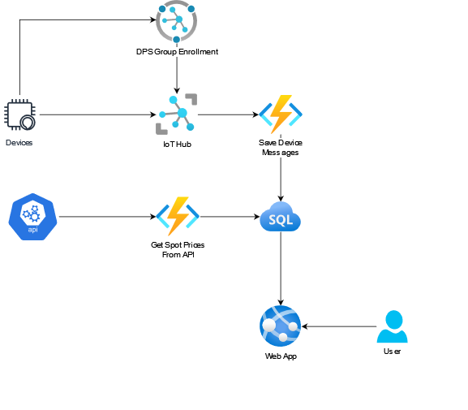

# ElPris

## Contents

- 
  - 
  - 
- 
  - 
  - 
    - 
    - 
  - 
  - 
    - 
    - 
    - 

## About
----

Elpris is a cloud project meant to provide experience and familiarity with cloud architectures and scale-ability via the cloud, in this case with Azure.

Also an excuse to try out web development with the new version of .NET Core 6 that came out this November.

### **Use case**

 The goal of the project is to combine energy readings from sensor devices with electricity spot prices from an open API and visualize the data. Allowing better decisions and awareness of electricity consumption.

 The project consists of a device a user would be able to plug into any other electric device in their home or business. The device would be able
 to measure the amount of power used by the device and then sent that data to the cloud via Azure.

 The data would then be processed and combined with the users power providers prices. The user would then be able to access this information via a web app.

 The user would then be able to modify and group their devices via the web app.

### **Constraints**

Due to the limited amount of time the features for grouping devices was never finished although it is supported in the database and the next feature to be worked on.

Electricity prices are differ depending on provider, contract and location meaning a user system is needed where the user can provide information needed to link the data with the correct cost data. Also a user system would take care of the only real weakness in the system regarding the ability to scale the system. But because of the limited time this is pushed into possible future work.

To compromise and still be able to show electricity prices the prices are now fetched from **Vattenfall** and are fetches from the current spot prices. Which does not reflect the price an end consumer may have.

## System Architecture
----

<div align="center">
    <br>
    
  </a>
    <br>
</div>

The system architecture is built heavily on Azure IoT and cloud services. With **IoT Hub** and **DPS** connecting the devices with the cloud. **Azure Functions** processing messages and inserting them into the SQL database.

User interaction with the data is provided with a web app also hosted on Azure.

The project leans heavily on the Azure infrastructure to leverage Azures ability to scale and balance according to load, as well to use Azures support, application data and monitoring.


### Device
----

The device for this project is a simulated device created via a python app using the **Azure Python IoT SDK.** It sends a generated sensor reading of measured kiloWatt to the Azure IoT Hub once every hour.
```python
        while True:
            
            data = dict()

                
            data['measurement'] = generateNewData(last_measurement)
            data['adress'] = device_id 
            data['timestamp'] = datetime.now().strftime('%m/%d/%Y, %H:%M:%S')

            data_json = json.dumps(data)

            print(f'Sending message : {data_json}')
            msg = Message(data_json)
            msg.content_type = "application/json"

            await device_client.send_message(msg)

            time.sleep(60*60)
```

The devices are provisioned via Azure DPS using group enrollment with a *symmetric key*  to automatically register the devices on the created IoT Hub used to communicate with the cloud services, to allow for scale-ability of device registration.

```python
    def register_device(registration_id):

        provisioning_device_client = ProvisioningDeviceClient.create_from_symmetric_key(
            provisioning_host=provisioning_host,
            registration_id=registration_id,
            id_scope=id_scope,
            symmetric_key=derivied_device_key,
        )

        return provisioning_device_client.register()
```


### Functions
----
Azure functions are used to process data from both the IoT Hub message queue and the spot price API and insert them into the database. The main benefits of the Azure functions is that they're serverless and elastic meaning they have the ability to quickly scale to demand as the number of messages increase or decrease.

They also provide greater control and customization than other Azure services like Data Factory or Logic Apps.

#### **SaveMessage**

The SaveMessage function processes device messages sent to the IoT Hub message queue. By deserializing them, assigning the correct device id provided by the DPS service to the IoT Hub and inserting the message into the SQL database.

```c#
            using(var conn = new SqlConnection(Environment.GetEnvironmentVariable("DBConn")))
            {
                conn.Open();
                // cmd queries set in functions
                using var cmd = new SqlCommand("", conn);

                // id container
                var TableIds = new Id
                {
                    DeviceId = GetDeviceId(cmd, msg),
                    PriceId = GetPriceId(cmd, msg)
                };

                AddMeasurement(cmd, msg, TableIds);

            }
```

#### **GetSpotPrices**

GetSpotPrices is a time triggered azure function that makes API calls to Vattenfall for the spot prices of the day. The function is triggered once a day at midnight and processes the response and inserts the data into the database.

The function is triggered once a day to avoid overloading the API with calls, keeping the amount of resources used the same as the amount of devices increase.

```c#
        [FunctionName("GetSpotPrice")]
        public static void Run([TimerTrigger("0 0 0 * * *")]TimerInfo myTimer, ILogger log)
        { 
            log.LogInformation($"C# Timer trigger function executed at: {DateTime.Now}");

            // fetch spot prices from API
            var result = GetApiResponse().GetAwaiter().GetResult();

            var prices = JsonConvert.DeserializeObject<List<SpotPrice>>(result);
            
            // add spot prices to database table spot_prices
            AddPricesToDB(prices);

            log.LogInformation("Spot prices added to DB");
        }
```

### Database
----
The project use case means a relational database was needed to be able to represent different users and groups with their relationship to devices and data. As well as the ability to scale per need.

The choice fell on Azure SQL database which is a cloud hosted relational database on Azure with the ability to scale dynamically with need, either automatically using elastic scaling options or manually with the click of a button.

### WebApp
----
The web app provides a user interface to the data and the devices. The web app is hosted via Azure App services providing integration with the rest of the project using Azure services, scale-ability and application monitoring.

The web app itself is built on ASP .NET Core 6 with an MVC project template. The .NET Core 6 framework provides a database interface that allows the app to communicate directly with the database without a web API intermediate.

#### **Web App - Home**

The Home page of the web app provides an overview of the connected devices and their data. Two charts to view the distribution of cost among the devices and a list of devices that'll provide more in detail information about the device and its data.


Selecting a device to view brings up another page with charts visualizing device energy usage over time, total device energy usage and device energy cost.


#### **Web App - Devices**

The device page lets the user view the available devices and modify them by assigning an alias. Plans are also to give the user the ability to register their devices here and put them into groups.

The ability to put devices into groups was cut out due to time constraints.


#### **Web App - Prices**

The Price page provides a chart visualizing the latest spot prices over time. Plans are to change this page to provide information and visualization of plans and prices by different power providers in different areas.


